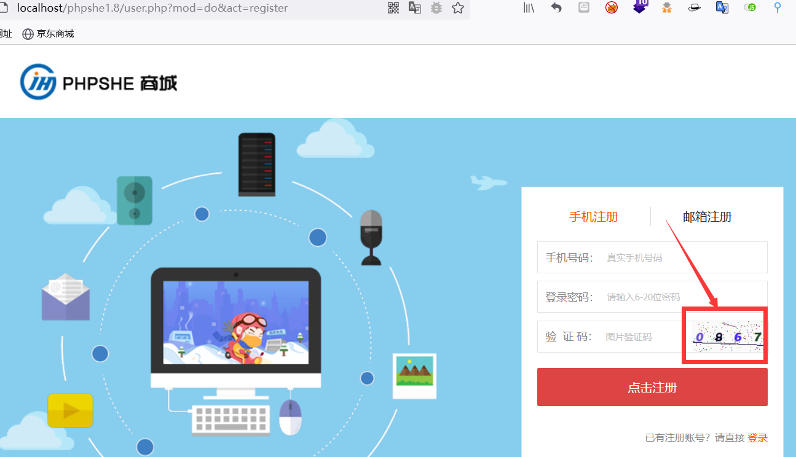
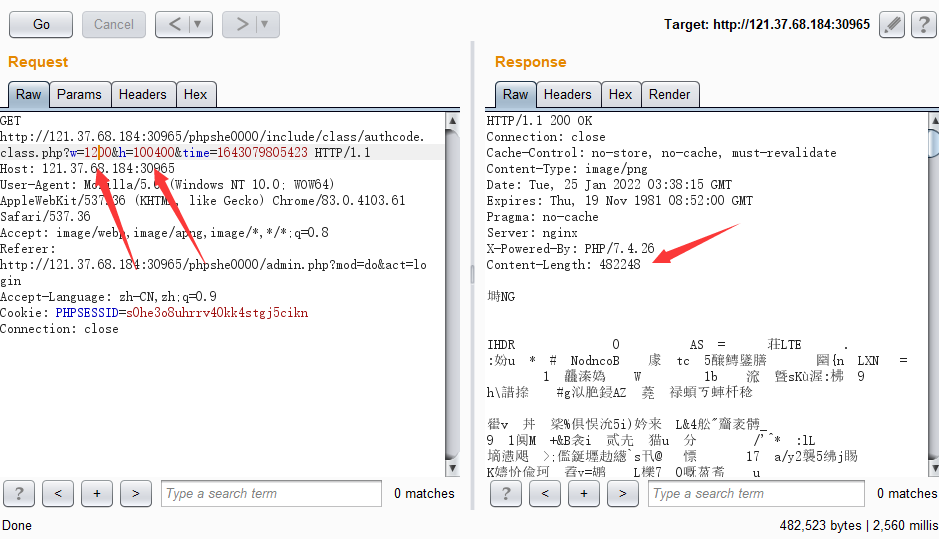
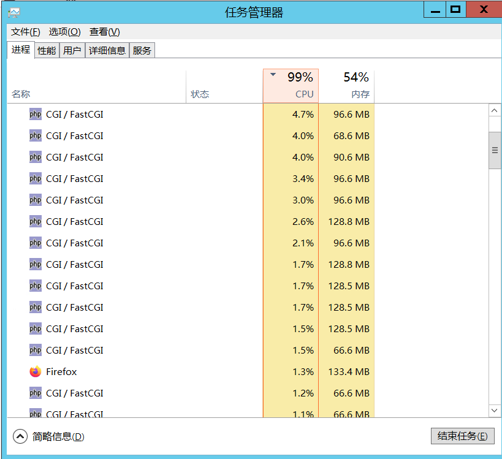

# phpshe
Program download address.
http://www.phpshe.com/down/phpshe1.8.rar

Of course, there are packages in this project.(phpshe1.8.rar)

There is a denial of access vulnerability in the registry's verification code.

I deployed the website with my own server,
Click the verification code to refresh the verification code, and then grab the request package,
Modify the length and width parameters of the verification code image, and you can see that the returned data is very long,

I didn't set up many threads, just 50, and my server (4-core 8G) almost crashed.

